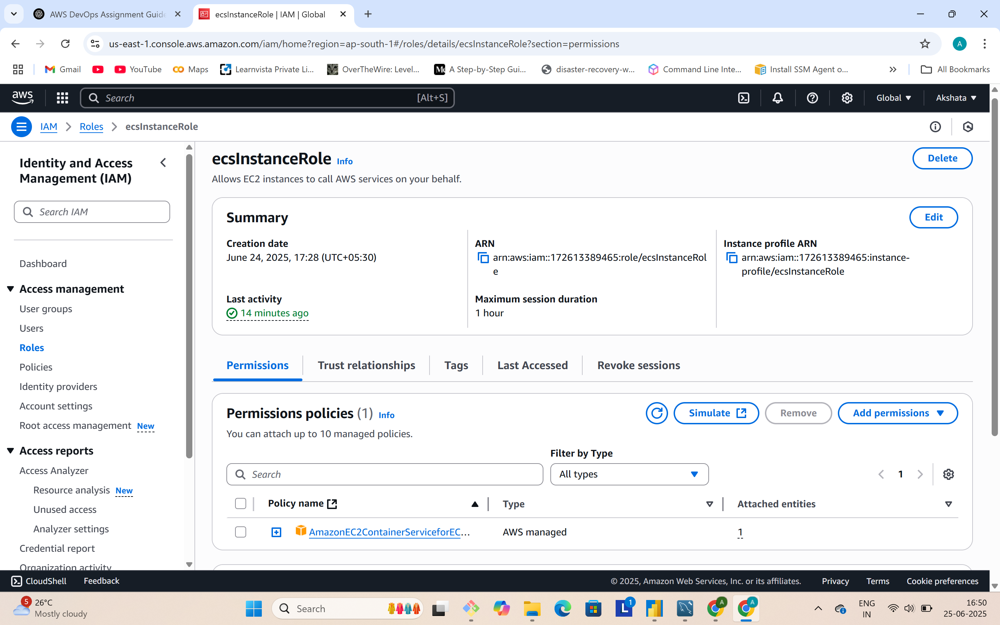
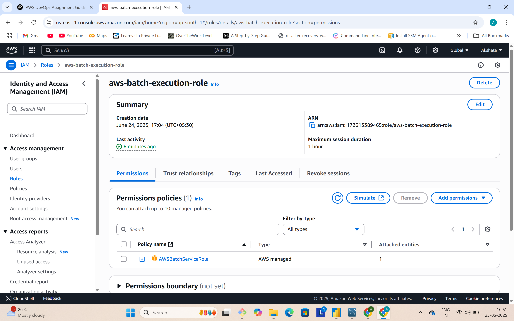
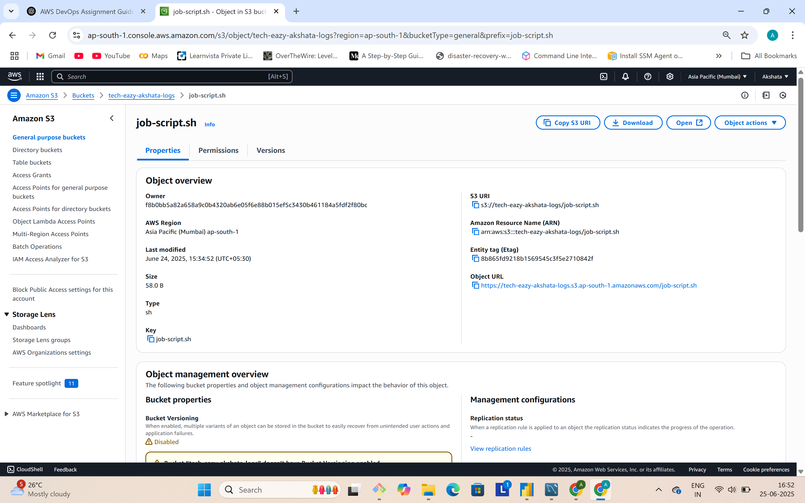
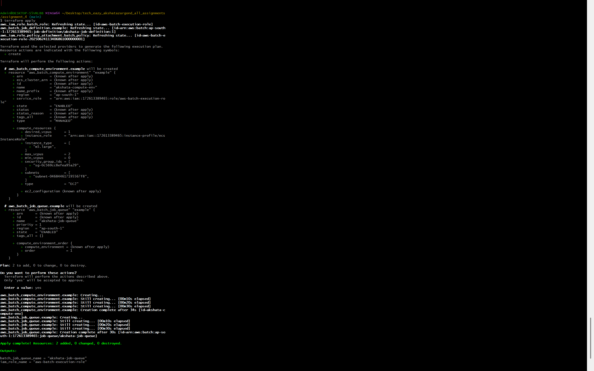
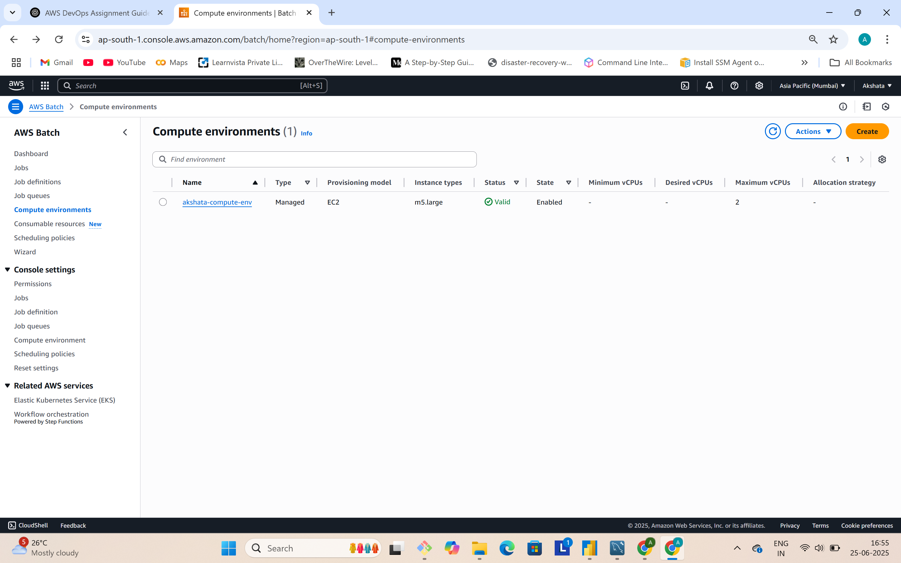
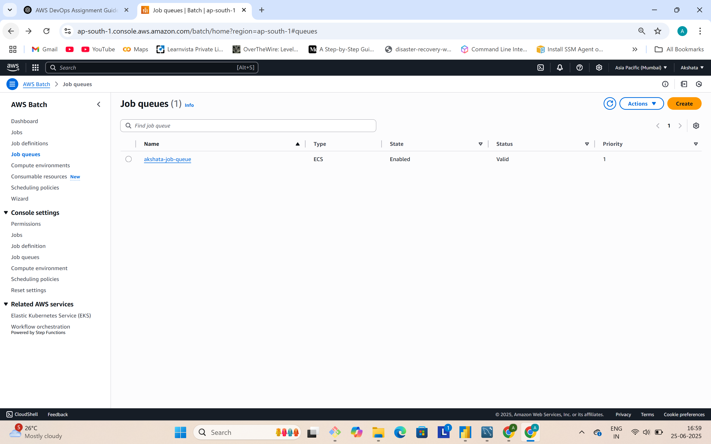
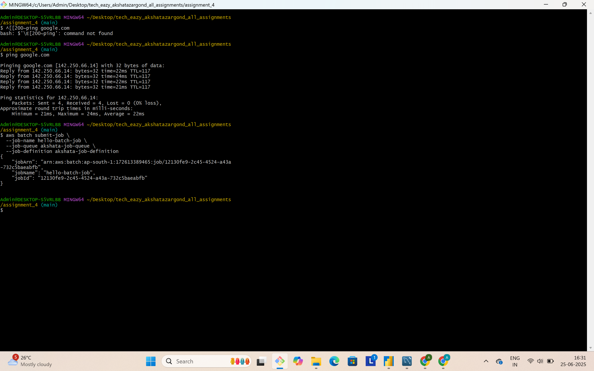
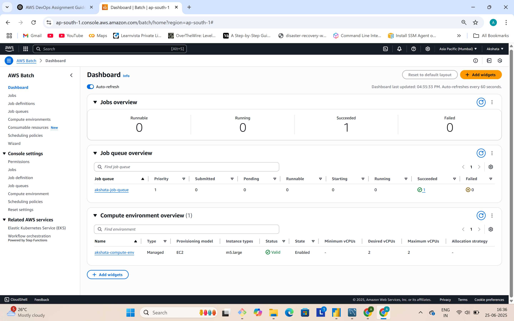

## ✅ Assignment 4: AWS Batch with Terraform + CLI

###  What I Did:
- Created IAM Role for Batch execution
- Defined Batch **Compute Environment** using EC2
- Configured **Job Queue** and **Job Definition** via Terraform
- Wrote a shell script (`job-script.sh`) that echoes a message
- Uploaded shell script to **S3 bucket**
- Submitted a Batch job via **AWS CLI**

###  Technologies:
- Terraform
- AWS Batch
- IAM Roles
- S3
- AWS CLI

###  Commands Used:

```bash
terraform init
terraform validate
terraform apply

Job submission via CLI:

bash
Copy
Edit
aws batch submit-job \
  --job-name hello-batch-job \
  --job-queue akshata-job-queue \
  --job-definition akshata-job-definition

# Testing:
Job successfully transitioned from Runnable → Succeeded

Verified via AWS Batch dashboard


## 📸 Screenshots

📸 Screenshots

### EC2 Instance Role creation  


### IAM Role for Batch Execution  


### S3 Bucket Created  


### Terraform Apply Output  


### Batch Compute Environment  


### Batch Job Queue  


### Batch Job Definition  


### Job Submitted via CLI  


### Job Dashboard (Success)  


